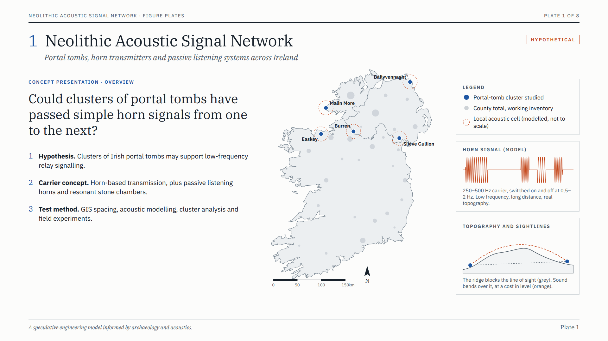
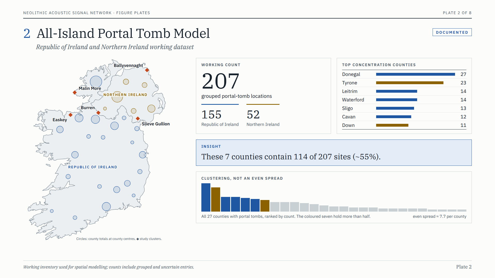
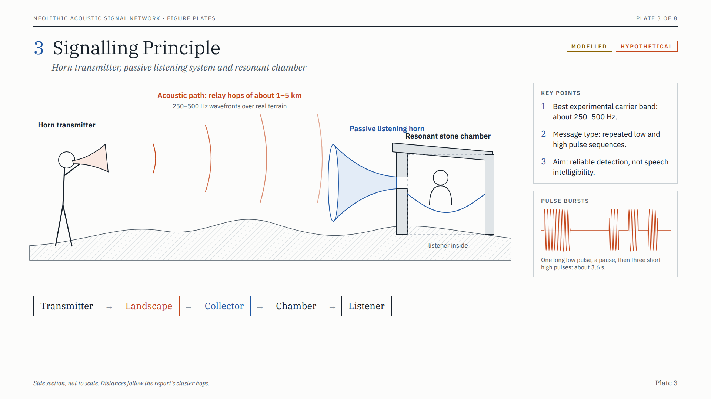
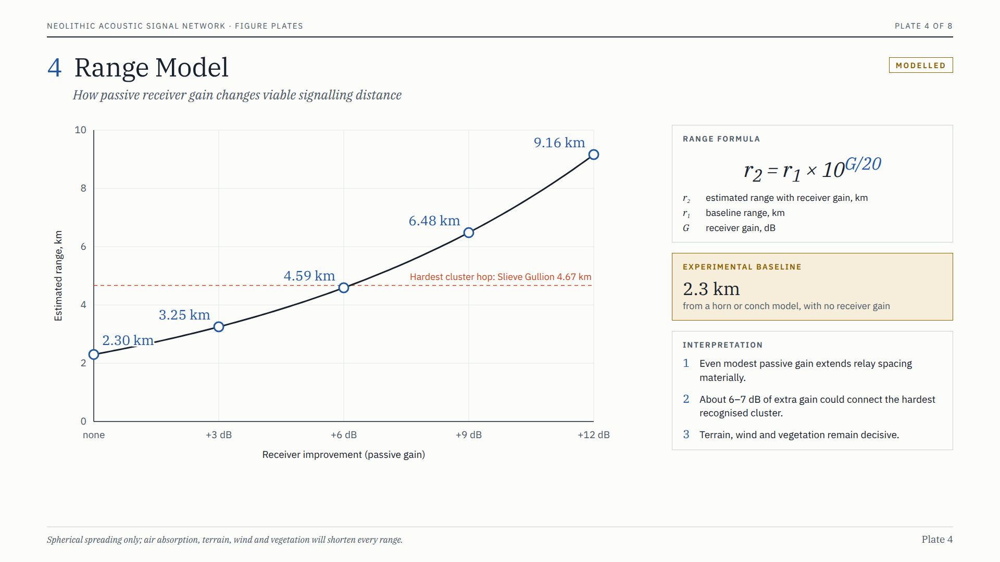
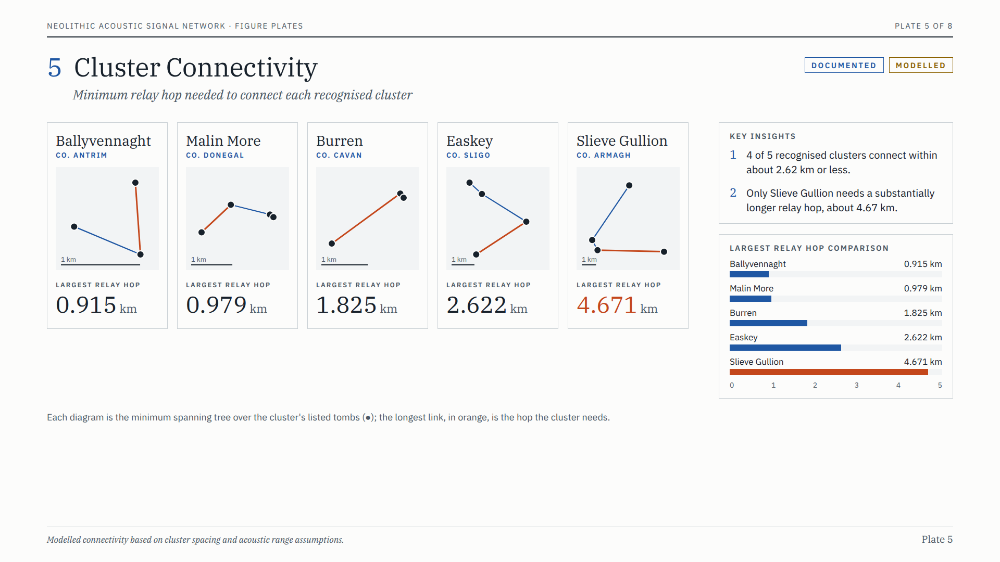
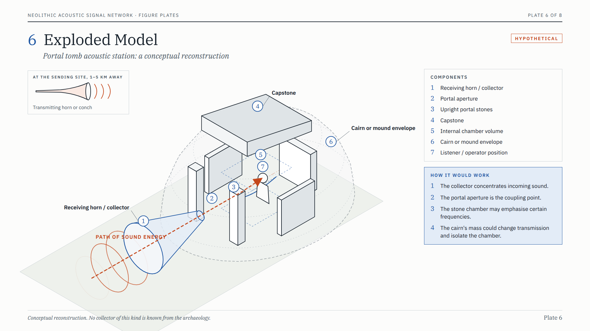
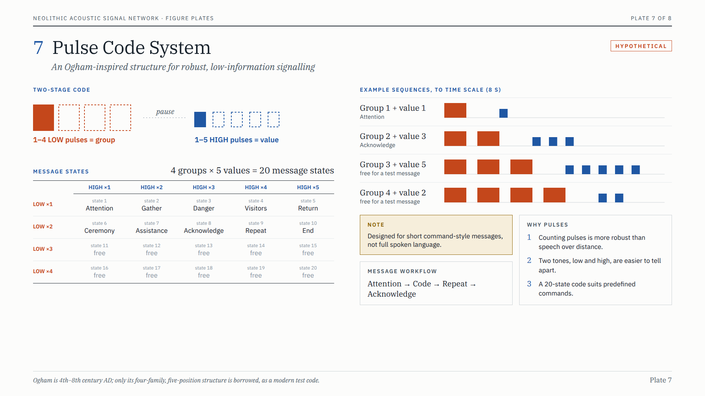
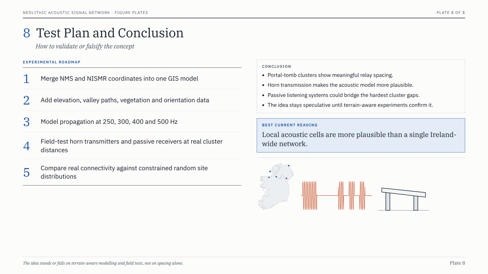

# Neolithic Acoustic Signal Network — Engineering Concept Report

**Status:** Speculative research / presentation concept  
**Scope:** Island of Ireland, including Northern Ireland  
**Prepared:** 2026-09-26  
**Repository:** `oisinryan/gods-and-fighting-men`  
**Base state reviewed:** `996b00944417d8920d8769464f904b173c89a159`

## 1. Executive summary

This report documents a testable engineering hypothesis: clusters of Irish portal tombs may have occupied landscapes in which simple long-distance acoustic signalling was physically possible.

The model does **not** claim that portal tombs were proven communications stations. Instead, it asks whether known monument spacing, chamber geometry, landscape position, horn technology and passive acoustic collection could support a relay system.

The strongest current interpretation is a network of **local acoustic cells**, rather than a single island-wide network.

The proposed signalling chain is:

```text
horn / conch transmitter
        ↓
250–500 Hz acoustic propagation
        ↓
passive listening horn / acoustic collector
        ↓
portal aperture
        ↓
resonant stone chamber
        ↓
human listener / relay operator
```

Information would be carried by slow, repeated pulse sequences rather than intelligible speech.

## 2. Archaeological scope

For this model, "dolmen" is treated as the archaeological class **portal tomb**.

The working all-island inventory currently used for spatial modelling contains approximately:

| Region | Working count |
|---|---:|
| Republic of Ireland | 155 |
| Northern Ireland | 52 |
| **Total** | **207 grouped locations** |

These are working GIS counts, not a claim that 207 intact, independently verified chambers survive. Records may include grouped, uncertain, destroyed or reclassified entries.

The largest concentrations in the working inventory are:

| County | Working count |
|---|---:|
| Donegal | 27 |
| Tyrone | 23 |
| Leitrim | 14 |
| Waterford | 14 |
| Sligo | 13 |
| Cavan | 12 |
| Down | 11 |

Those seven counties contain about **114 of 207 locations (~55%)**, showing strong clustering rather than uniform distribution.

Primary spatial sources:

- National Monuments Service / Archaeological Survey of Ireland
- Northern Ireland Sites and Monuments Record / Historic Environment Record

## 3. Recognised cluster connectivity

Five particularly useful portal-tomb clusters were used as an initial connectivity test.

The metric below is the **largest minimum relay hop** required to keep each cluster connected through a relay graph.

| Cluster | County | Largest required relay hop |
|---|---|---:|
| Ballyvennaght | Antrim | **0.915 km** |
| Malin More | Donegal | **0.979 km** |
| Burren | Cavan | **1.825 km** |
| Easkey | Sligo | **2.622 km** |
| Slieve Gullion | Armagh | **4.671 km** |

### Initial result

- **4 of 5** recognised clusters connect with maximum hops of about **2.62 km or less**.
- Slieve Gullion is the outlier, requiring about **4.67 km**.
- These ranges are compatible with powerful horn signalling under favourable terrain and atmospheric conditions.
- This does not establish intentional communications use; it establishes only that the spacing is physically interesting.
- Slieve Gullion's long hop runs over the mountain's summit; with two surviving non-portal-tomb monuments as relays it drops to 2.92 km (§3.1).

### 3.1 Slieve Gullion: what sits in the middle

The four Slieve Gullion portal tombs ring the mountain. Their mean position (54.1367 N, 6.4475 W) falls on its upper northern slope, 2.1–3.4 km from each tomb. The Northern Ireland Sites and Monuments Record (2018 copy) lists everything within 6 km of that point. Nothing is recorded within 1 km of it, but the mountain above it carries two cairns:

| SMR number | Monument | Period | From the centre |
|---|---|---|---:|
| ARM028:006 | North Cairn, Slieve Gullion: multiple cist cairn | Bronze Age | 1.00 km |
| ARM028:001 | The Long Stone, Ballard: standing stone | Prehistoric | 1.42 km |
| ARM028:007 | South Cairn, Slieve Gullion ("Calliagh Berra's House"): passage tomb | Neolithic | 1.88 km |

**The long hop crosses the summit.** The 4.67 km Clonlum–Aughadanove link passes 0.3 km from the summit passage tomb, halfway along. The summit is 573 m high and the tombs lie well below it, so at 250–500 Hz a direct link would lose heavily to diffraction over the ridge. In this model it would need a relay, and the summit is the obvious place for one.

**Relays shorten the network.** Recomputing the minimum spanning tree with surviving non-portal-tomb monuments as extra nodes:

| Nodes | Longest required hop |
|---|---:|
| Four portal tombs | 4.67 km |
| + summit passage tomb | 4.65 km |
| + the Long Stone | 4.05 km |
| + summit passage tomb and the Long Stone | **2.92 km** |

The summit alone splits Clonlum's link into 2.16 km and 2.55 km, but Aghmakane, in the north, stays 4.65 km from every other node. The Long Stone, between Aghmakane and the mountain, closes that gap (1.92 km). With both, Slieve Gullion falls in line with the other four clusters. These are flat map distances; the terrain between the points has not been checked.

**What may have been lost.**

1. *Recorded tombs whose position is lost:* megalithic tombs in Meigh (ARM029:035) and Aghadavoyle (ARM029:034), located only to the nearest kilometre, on the south and east sides of the mountain.
2. *Unclassified or possible tombs:* the Giant's Grave at Latbirget (ARM028:002) beside Ballykeel, a standing stone at Aughadanove that may be a tomb (ARM028:005), and a mound at Tullymacreeve (ARM028:022). If any were portal tombs, the cluster graph changes.
3. *Perishable structures:* timber platforms, listening collectors, or fire and smoke stations would leave little trace.
4. *The monuments' original form:* cairns have been robbed and reduced, and the summit cairns have been dug into.

**Cautions.** The summit passage tomb is probably younger than the portal tombs (c. 3800–3200 BC), and the North Cairn is Bronze Age, so the hub may be a later addition rather than part of an original design. A summit that overlooks all four tombs also suits fire or smoke signalling at least as well as sound, which weakens the case for an acoustic system specifically.

Lady Gregory's *Gods and Fighting Men* sets "The Hunt of Slieve Cuilinn" here: Finn is aged at the lake beside the summit, and the Fianna dig into "the hill of the Sidhe" for three days and nights until Cuilinn comes out of it. The story may preserve a memory of people digging into the summit cairn, but it is not evidence of one.

## 4. Transmitter model

A carnyx-style horn is useful as an acoustic analogue, but the Iron Age carnyx is far later than the Neolithic monuments.

A better prehistoric engineering analogue is the broader class of:

- shell trumpets,
- conches,
- wooden horns,
- bark or hide composite horns,
- lip-reed acoustic radiators.

Neolithic European shell trumpets demonstrate that loud horn-based signalling technology existed long before Iron Age metal horns.

For modelling, the preferred test band is approximately:

```text
250 Hz
300 Hz
400 Hz
500 Hz
```

This band is preferable to literal infrasound because it is much easier to generate efficiently with practical horns while retaining useful long-distance propagation.

## 5. Passive receiving system

The receiving concept uses a horn in reverse.

```text
incoming sound field
        ↓
large horn mouth / acoustic collector
        ↓
narrow throat
        ↓
portal aperture
        ↓
stone chamber
        ↓
listener
```

A passive acoustic collector can increase sound pressure at its throat by concentrating acoustic energy over a larger capture area.

For engineering tests, receiver improvement should be evaluated conservatively at:

- +3 dB
- +6 dB
- +9 dB
- +12 dB

Using an experimental reference distance of **2.3 km** (consistent with measured Neolithic shell trumpets; see §17.1), the idealised range scaling is:

```text
r₂ = r₁ × 10^(G/20)
```

| Receiver gain | Idealised range |
|---:|---:|
| 0 dB | 2.30 km |
| +3 dB | 3.25 km |
| +6 dB | 4.59 km |
| +9 dB | 6.48 km |
| +12 dB | 9.16 km |

These values are link-budget scenarios only. Real propagation can be substantially reduced by terrain, vegetation, wind direction, atmospheric structure and ground effects.

A useful result is that roughly **6–7 dB** of additional receiver advantage would, on distance alone, place the longest Slieve Gullion relay hop inside the modelled range.

## 6. Portal tomb as acoustic coupling structure

The present exposed appearance of many portal tombs is not necessarily the correct acoustic reconstruction.

Many monuments originally included cairn or mound material around the chamber.

The conceptual receiving station therefore consists of:

1. **Receiving horn / collector**  
   Concentrates incoming acoustic energy.

2. **Portal aperture**  
   Couples the collector to the chamber.

3. **Upright portal stones**  
   Define the entrance geometry and support the capstone.

4. **Capstone**  
   Forms a massive upper acoustic boundary.

5. **Internal chamber**  
   Provides an enclosed resonant volume.

6. **Cairn / mound envelope**  
   Adds mass, isolation and potentially changes transmission behaviour.

7. **Listener / relay operator**  
   Occupies a high-SNR position in or close to the chamber.

This architecture remains hypothetical. No claim is made that surviving socket holes, apertures or structural features have yet been demonstrated to support acoustic hardware.

## 7. Resonance

Portal tomb chambers are small enough for audible room modes to occur in the same broad frequency region as powerful horns and low-frequency human vocalisation.

A simple characteristic dimension around 1.5–2.0 m gives first-order room modes roughly in the **80–120 Hz** region.

That does not imply deliberate tuning.

The testable prediction is:

> If acoustic use was important, measured intact chambers may show repeatable, functionally useful amplification or increased signal-to-noise ratio at particular frequencies.

The field experiment should measure simultaneously:

- external SPL,
- portal SPL,
- chamber SPL,
- frequency response,
- decay time,
- signal-to-noise ratio,
- bearing sensitivity.

## 8. Pulse-code communication

Ogham itself is much later than the Neolithic and is **not** evidence for Neolithic language or signalling.

However, its four-family / five-position organisational structure provides a useful modern test code.

The proposed experimental code is:

```text
1–4 LOW pulses = group
pause
1–5 HIGH pulses = value
```

This gives:

```text
4 groups × 5 values = 20 message states
```

Rather than spelling words, each state should represent a predefined command.

Example experimental message classes could include:

- attention,
- gather,
- danger,
- visitors,
- return,
- ceremony,
- assistance,
- acknowledgement,
- repeat,
- end.

A practical protocol:

```text
ATTENTION
→ GROUP
→ pause
→ VALUE
→ long pause
→ repeat
→ acknowledgement
```

The objective is **reliable detection**, not speech intelligibility.

## 9. Why pulse signalling is preferable to speech

Speech intelligibility depends heavily on higher-frequency spectral detail and suffers rapidly with distance, reverberation and terrain masking.

Pulse communication requires only:

- detecting a signal,
- distinguishing one or two tone classes,
- counting events,
- recognising pauses.

This greatly lowers the required information bandwidth.

A relay operator could therefore decode a signal that would be far too degraded for meaningful speech.

## 10. Newgrange relevance

Newgrange should be treated as an important **acoustic and architectural analogue**, not as evidence that the same builders designed every portal tomb.

Newgrange demonstrates that Neolithic stone monuments can produce complex standing-wave and chamber acoustic behaviour.

The current model does **not** rely on direct infrasonic communication.

The more credible engineering interpretation is:

- audible low-frequency horn carrier,
- slow pulse-envelope modulation,
- architectural or horn-based receiver gain,
- human relay.

## 11. Landscape model

The decisive next stage is terrain-aware GIS modelling.

Required layers:

- NMS portal-tomb coordinates,
- NISMR / HERoNI coordinates,
- digital elevation model,
- ridgelines,
- valleys,
- watercourses,
- reconstructed vegetation scenarios,
- portal orientation where known,
- chamber dimensions where known,
- local source/receiver elevation.

For every monument pair, calculate:

- distance,
- bearing,
- elevation difference,
- line of sight,
- diffraction penalty,
- predicted SPL at 250 / 300 / 400 / 500 Hz,
- receiver gain scenarios,
- potential relay membership.

## 12. Null hypothesis

Spatial clustering alone is not evidence for communications.

The correct statistical test is not to compare monument locations with points randomly distributed over the whole island.

Instead, run constrained Monte Carlo simulations in landscapes matched for:

- elevation,
- geology,
- proximity to water,
- cultivable land,
- known Neolithic settlement suitability,
- regional monument density.

Then compare:

- number of viable acoustic links,
- network component size,
- relay path length,
- node degree,
- orientation alignment,
- average required gain.

A genuine communications signal should outperform environmentally constrained random distributions.

## 13. Falsification criteria

The concept should be weakened or rejected if terrain-aware analysis finds that:

1. recognised clusters require implausibly high sound levels;
2. portal orientations are statistically unrelated to neighbouring sites;
3. chamber measurements show no useful acoustic enhancement;
4. constrained random site distributions produce equivalent or better connectivity;
5. likely Neolithic vegetation destroys most of the proposed links;
6. required receiving hardware would need dimensions or materials inconsistent with Neolithic technology.

The concept would become more interesting if several independent tests converge:

1. unusually strong acoustic connectivity;
2. repeatable directional relationships;
3. chamber resonance that improves detectability;
4. plausible perishable receiver geometry;
5. field-tested horn signals reliably crossing real cluster distances.

## 14. Remotion presentation architecture

A high-tech Remotion presentation concept has been designed around the following sequence:

1. **Neolithic Acoustic Signal Network**  
   Hero overview and Ireland network map.

2. **All-Island Portal Tomb Model**  
   ROI + NI dataset, concentrations and cluster locations.

3. **Signalling Principle**  
   Horn → landscape → collector → chamber → listener.

4. **Range Model**  
   Receiver gain versus viable relay distance.

5. **Cluster Connectivity**  
   Ballyvennaght, Malin More, Burren, Easkey and Slieve Gullion, with an optional Slieve Gullion variant that adds the summit passage tomb and the Long Stone as relays (§3.1).

6. **Exploded Model**  
   Portal tomb acoustic-station conceptual reconstruction.

7. **Pulse Code System**  
   Ogham-inspired 4 × 5 experimental command structure.

8. **Test Plan & Conclusion**  
   GIS, acoustic modelling, field tests and falsification.

Static white-paper versions of these eight slides are in Appendix A.

### Visual system

- 16:9
- black / charcoal base
- cyan / teal technical UI
- orange acoustic highlights
- animated GIS nodes
- wavefront propagation
- exploded stone geometry
- spectrum / waveform overlays
- animated relay links
- subtle topographic grid
- evidence-status labels distinguishing measured data from speculative reconstruction

## 15. Suggested Remotion animation language

Recommended motion system:

- progressive map-node reveal,
- travelling acoustic pulse arcs,
- range rings that expand and decay,
- camera parallax over terrain,
- animated minimum-spanning-tree links,
- exploded tomb components separating along the sound axis,
- resonant standing-wave animation within the chamber,
- low/high pulse-code traces,
- spectrum analyser sweeps,
- smooth number interpolation for range calculations,
- evidence-status tags: `MEASURED`, `MODELLED`, `HYPOTHETICAL`.

## 16. Current conclusion

The strongest defensible statement is:

> Known Irish portal-tomb clusters include relay spacings that are physically compatible with powerful horn signalling, especially if passive acoustic collection is added at the receiving site.

What has **not** been established is that the monuments were constructed for this purpose.

The current model therefore remains:

**physically plausible in local clusters, archaeologically unproven, and experimentally testable.**

## 17. World parallels

No monument anywhere is known to have worked as an acoustic relay station, with or without a listening collector. Each part of the proposed system does have a real precedent, and together they show which parts are well supported and which are not.

| Part of the system | Best parallel | What it shows | Gap to this model |
|---|---|---|---|
| Loud horn transmitter | Neolithic conch trumpets, Catalonia, late 5th–early 4th millennium BC | Seven of eight playable *Charonia* trumpets peak above 100 dBA at 1 m, up to 111.5 dBA; the authors suggest signalling "beyond visual range, and perhaps over several kilometres" | Measured in Iberia, not Ireland; no range was tested in the field |
| Monument built around trumpets | Chavín de Huántar, Peru, c. 1200–500 BC | Twenty decorated conch trumpets found in the galleries (2001); narrowing passages act as waveguides carrying trumpet sound from inside to outside | Ritual sound within one site, not a link between sites |
| Relay of messages by sound | Talking drums of the Congo (lokole) | One drum carries about 4–5 miles by day and 6–7 miles in the cool of morning and evening; relayed from village to village, a message could cover about 100 miles in an hour | Recorded in the 20th century; portable drums, not monuments |
| Coded signals over kilometres | Silbo Gomero, whistled language, Canary Islands | Messages across ravines up to about 5 km, 8 km in good conditions | Recent; a whistled language, not a pulse code |
| Passive collector giving range | British concrete sound mirrors, 1920s–30s (Denge and elsewhere) | Focusing sound on a listening point detected aircraft at about 20 miles (32 km), more for the largest | Modern engineering; nothing comparable is known from prehistory |
| Chamber resonance | Ħal Saflieni Hypogeum, Malta; Newgrange; Stonehenge (scale model) | Neolithic chambers resonate near 70–120 Hz; Stonehenge's circle gave about 0.6 s of reverberation, helping voices and drums inside it | Effects are for people inside the monument, not for sound sent or received from far away |
| Horns in Ireland | Irish Bronze Age horns (over 120, 26 in the Dowris hoard) | Ireland holds more than half the Bronze Age horns known from Europe and the Middle East | About 2,000 years after the portal tombs; signalling versus ceremony is debated |

### 17.1 What the parallels change in this model

**The transmitter is the best-supported part.** The Catalan measurements give the report's baseline a source. Under the spreading-only model of §5 with a 40 dB detection level, 100–111.5 dBA at 1 m gives an unaided range of 1.0–3.8 km. The 2.3 km reference used throughout this report sits inside that span; it corresponds to a horn of about 107 dBA. With +6 dB of receiver gain the same horns reach 2.0–7.5 km, before air absorption and terrain.

**Acoustic relays of this hop length are proven.** The Congo drum networks relayed messages in hops of several kilometres, the same scale as the Irish clusters' 0.9–4.7 km. They did it with portable instruments and people, which is the null case for this model: relays need no special architecture.

**The monument as receiver is the unsupported step.** The collector idea is sound in physics (the sound mirrors), and chambers do have acoustic character (Malta, Newgrange, Stonehenge), but every known effect is for listeners inside a monument. Chavín is the only site demonstrably shaped around trumpets, and its sound stayed within the complex.

**Where prehistoric and early historic societies built fixed relay chains, they were visual:** fire beacons on high points. A summit such as Slieve Gullion (§3.1) suits a beacon at least as well as a horn.

### 17.2 In Irish tradition

Lady Gregory's *Gods and Fighting Men* gives Finn a signalling horn, the Dord Fiann, "the Mutterer of the Fianna". Its blast brings Diarmuid to Finn's rescue, the scattered Fianna "answered with a shout, every one hurrying to be the first", and fifty men sound it. The Fianna are said to sleep in a cave until it is sounded three times. This is legend, not evidence, but it shows how naturally the stories imagine a horn calling people across country.

## 18. Reference starting points

- National Monuments Service / Archaeological Survey of Ireland:  
  https://data.gov.ie/dataset/national-monuments-service-archaeological-survey-of-ireland
- Northern Ireland Sites and Monuments Record:  
  https://admin.opendatani.gov.uk/dataset/northern-ireland-sites-and-monuments-record
- UCC overview of Ogham / Stone Corridor:  
  https://www.ucc.ie/en/discover/visit/stone-corridor/
- Cambridge Antiquity — architecture and sound in megalithic monuments:  
  https://www.cambridge.org/core/journals/antiquity/article/architecture-and-sound-an-acoustic-analysis-of-megalithic-monuments-in-prehistoric-britain/F37AF50641B26AC288BA756A1C12EA33
- Palaeolithic conch acoustic study:  
  https://pmc.ncbi.nlm.nih.gov/articles/PMC7875526/
- Northern Ireland Sites and Monuments Record, 18 May 2018 copy, as an ArcGIS layer (used for §3.1):  
  https://services3.arcgis.com/HRuPlEcokYlz4mdz/arcgis/rest/services/NI_SMR_18_5_18/FeatureServer/0
- Slieve Gullion passage tomb and the Ring of Gullion monuments:  
  https://ringofgullion.org/landscape-heritage/built-heritage/
- Lady Gregory, *Gods and Fighting Men* (Project Gutenberg #14465), Part II Book 4, Chapter XV, "The Hunt of Slieve Cuilinn".
- López-Garcia, M. and Díaz-Andreu, M. 2025. Signalling and music-making: interpreting the Neolithic shell trumpets of Catalonia (Spain). *Antiquity*:  
  https://doi.org/10.15184/aqy.2025.10220
- Chavín de Huántar Archaeological Acoustics Project, Stanford CCRMA:  
  https://ccrma.stanford.edu/groups/chavin/
- Carrington, J. F. 1949. *The Talking Drums of Africa*:  
  https://missiology.org.uk/pdf/e-books/carrington_j-f/talking-drums-of-africa_carrington.pdf
- Silbo Gomero:  
  https://en.wikipedia.org/wiki/Silbo_Gomero
- Denge sound mirrors:  
  https://en.wikipedia.org/wiki/RAF_Denge
- Archaeoacoustic analysis of the Ħal Saflieni Hypogeum, Malta:  
  https://www.um.edu.mt/library/oar/bitstream/123456789/16630/1/OA%20Archaeoacoustic%20Analysis%20of%20the%20%C4%A6al%20Saflieni%20Hypogeum%20in%20Malta.pdf
- Fazenda, B., Cox, T. et al. 2020. Using scale modelling to assess the prehistoric acoustics of Stonehenge. *Journal of Archaeological Science*:  
  https://www.sciencedirect.com/science/article/pii/S0305440320301394
- Irish Bronze Age horns and their relations with Northern Europe, *Proceedings of the Prehistoric Society*:  
  https://www.cambridge.org/core/journals/proceedings-of-the-prehistoric-society/article/abs/irish-bronze-age-horns-and-their-relations-with-northern-europe/FCE3CC56CE3FC20F51EC3A0E7D9C940B

---

## Appendix A. Figure plates

These eight plates redraw, in the report's white-paper style, the slide images ChatGPT generated from its presentation prompts (listed as "Slide image" 1–8 and 10 in [`chatgpt/analysis-code.md`](chatgpt/analysis-code.md); image 9 and 10 were corrections to slide 5). They follow each prompt's content, with these changes:

- **Numbers follow this report.** The carrier is 250–500 Hz, switched at 0.5–2 Hz (the prompt said "~0.5–5 Hz"); relay hops are about 1–5 km (the prompt said "~2–7 km").
- **Local cells, not an island-wide network.** Plate 1 marks local acoustic cells instead of arcs linking clusters across the island.
- **Line drawings instead of photographs and slogans.** The prompts' landscape photographs and taglines ("Landscapes resonate") are left out.

The plates are rendered from `presentation/src/plates/` with `npm run plates` and saved in `figures/plates/`.

### Plate 1. Neolithic Acoustic Signal Network



Overview: the hypothesis, the carrier concept and the test method, with the five study clusters over the county totals, a model horn signal, and a sightline section showing sound bending over a ridge that blocks the line of sight.

### Plate 2. All-Island Portal Tomb Model



The 207-location working inventory (155 Republic, 52 Northern Ireland), the seven densest counties holding 114 of 207 (~55%), and the ranked county counts showing clustering rather than an even spread.

### Plate 3. Signalling Principle



The signal chain in section: horn transmitter, 250–500 Hz wavefronts over terrain, passive listening horn, resonant stone chamber and listener, with a pulse-burst inset.

### Plate 4. Range Model



The benchmark ranges from §5 (2.30, 3.25, 4.59, 6.48 and 9.16 km at 0 to +12 dB) against Slieve Gullion's 4.67 km hop, with the formula and the 2.3 km baseline.

### Plate 5. Cluster Connectivity



Minimum-spanning-tree diagrams for the five clusters from their tomb coordinates, the largest hop in each (0.915, 0.979, 1.825, 2.622 and 4.671 km), and a comparison bar chart.

### Plate 6. Exploded Model



Exploded axonometric of the conceptual receiving station (§6), with the sending horn, the path of sound energy and four functional notes.

### Plate 7. Pulse Code System



The two-stage code (§8), the 4 × 5 table of message states, and four example sequences drawn to time scale.

### Plate 8. Test Plan and Conclusion



The five-step roadmap (§11–13), the conclusions, and the best current reading: local acoustic cells are more plausible than a single Ireland-wide network.

---

## Evidence status

This repository report intentionally separates:

- **documented archaeology**
- **measured acoustics**
- **engineering extrapolation**
- **speculative reconstruction**

No archaeological claim in this document should be read as evidence that an acoustic communication network has been demonstrated.
